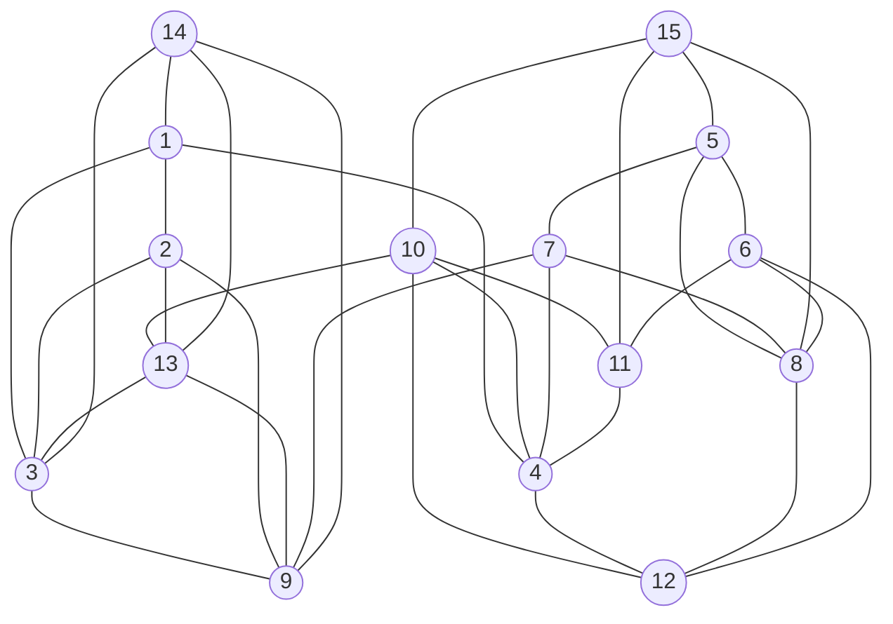
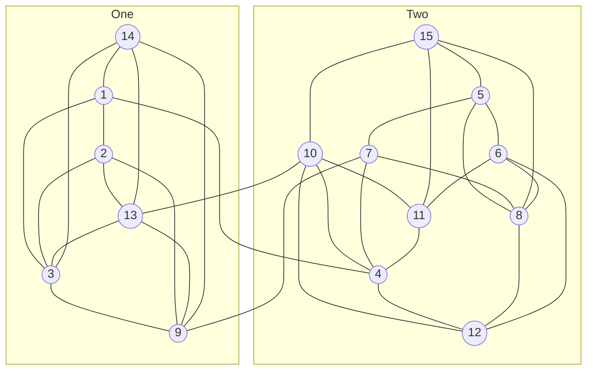
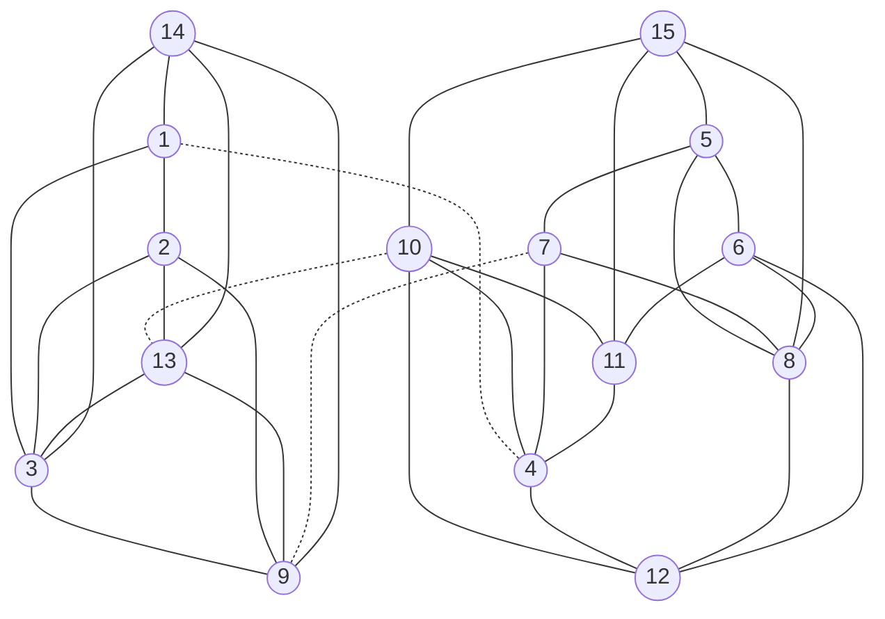
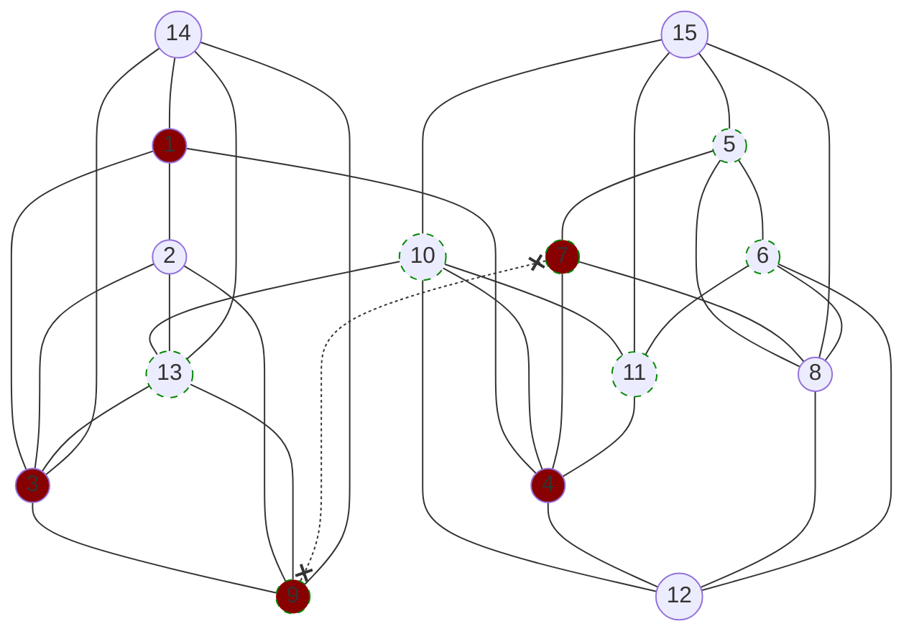
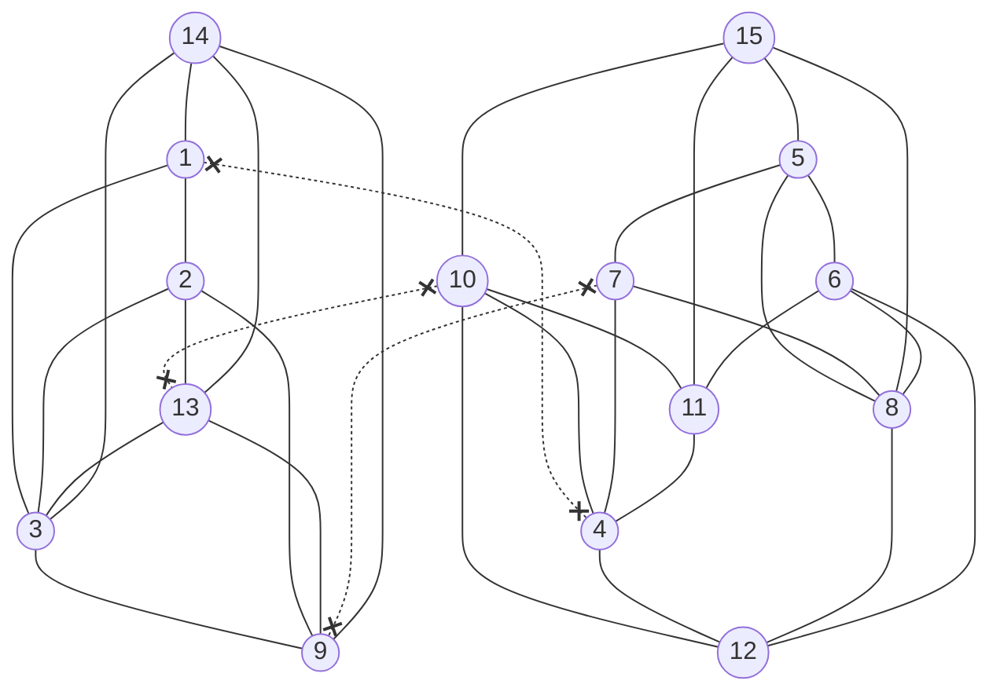

# **Hello there! :wave:**

Here are my solutions for the AoC 2023 problems. I've opted for Rust :crab: this time,  an intriguing language I'm just starting to get familiar with.

<details>
<summary>Usage</summary>
<br>
 
 > Note : Intended for Windows machines

- _Paste your input inside_ ***input.txt***
- Run: ```make run n``` for day n, part 1, or ```make run np2``` for part 2.
  
> Use ```make clear``` if you wish to delete the generated executables

</details>


# Progress

| Day | Done (both parts)    | Pushed               | Detailed                | Elegance of my approach | Benchmarks (*)       |
|-----|----------------------|----------------------|-------------------------|-------------------------|--------------------- | 
| 1   | :white_check_mark:   |  :white_check_mark:  |    :x:                  |                         | `1.01ms` - `3.15ms`  |
| 2   | :white_check_mark:   |  :white_check_mark:  |    :x:                  |                         | `1.21ms` - `1.80ms`  |
| 3   | :white_check_mark:   |  :white_check_mark:  | :x:                     |                         | `1.04ms` - `2.09ms`  |
| 4   | :white_check_mark:   |  :white_check_mark:  |    :x:                  |                         | `3.41ms` - `2.61ms`  |
| 5   | :white_check_mark:   | :white_check_mark:   | :clock430:              | :star:                  | `646µs` - `1.79ms`   |
| 6   | :white_check_mark:   |  :white_check_mark:  |[:white_check_mark:](#6) |        :star:           | `299µs` - `250µs`    |
| 7   | :white_check_mark:   |  :white_check_mark:  | :clock430:              |     :star:  :star:      |_requires improvement_|
| 8   | :white_check_mark:   |     :clock430:       | :clock430:              |                         |_requires improvement_|
| 9   | :white_check_mark:   |  :white_check_mark:  |    :x:                  |                         | `2.15ms` - `3.96ms`  |
| 10  | :white_check_mark:   |  :white_check_mark:  |[:white_check_mark:](#10)|     :star:  :star:      | `1.70ms` - `2.12ms`  |
| 11  | :white_check_mark:   |  :white_check_mark:  |    :x:                  |                         | `3.48ms` - `3.253ms` |
| 12  | :white_check_mark:   |     :clock430:       |                         |                         |                      |
| 13  | :white_check_mark:   | :white_check_mark:   |    :x:                  |                         | `1.06ms` - `899µs`   |
| 14  | :white_check_mark:   | :white_check_mark:   |    :x:                  |                         |  `714µs` - `733ms`   |
| 15  | :white_check_mark:   | :white_check_mark:   | :x:                     |                         |  `509µs` - `3.55ms`  |
| 16  | :white_check_mark:   | :white_check_mark:   | :x:                     |                         | `5.46ms` - `854ms`   |
| 17  | :white_check_mark:   | :clock430:           |                         |                         |                      |
| 18  | :white_check_mark:   | :white_check_mark:   | :x:                     |                         | `439µs` - `479µs`    |
| 19  | :white_check_mark:   | :white_check_mark:   |                         |                         | `5.31ms` - `5.86ms`  |
| 20  | :white_check_mark:   |                      |                         |                         |                      |
| 21  |                      |                      |                         |                         |                      |
| 22  | :white_check_mark:   | :white_check_mark:   | :clock430:              |                         | `9.74ms` - `940ms`   |
| 23  |                      |                      |                         |                         |                      |
| 24  |                      |                      |                         |                         |                      |
| 25  | :white_check_mark:   | :white_check_mark:   |[:white_check_mark:](#25)| :star: :star:           | `572ms`              |

 > Note (*) : Using a single computing time, with a Intel Core i7-13700H (1.8 - 2.4GHz), unoptimized (default rustc build).

<br><br>

<a id="6"></a>
## Day 6
<br>
 
To determine the number of ways to win a race, we consider the score $s_k$ achieved by pressing the button for $k$ milliseconds. This score is calculated by multiplying the duration the button is pressed $k$ by the remaining time $T - k$, where $T$ is the total race duration.

Mathematically, this is expressed as ${s_k} = k(T - k)$ for $k$ in { ${0, 1, \dots, T}$ }.

The objective is to find the number of possible values of $k$ for which $s_k > R$, where $R$ is the race record. This leads to the inequality:

$k^2 - T k + R < 0$

The corresponding quadratic equation is $k^2 - T k + R = 0$, with a determinant $\Delta = \sqrt{T^2 - 4R}$.

If $T^2 - 4R \leq 0$, then the inequality has no solution. However, if $T^2 - 4R > 0$, two solutions $x_+$ and $x_-$ are obtained:

$x_{\pm} = \frac{T \pm \sqrt{\Delta}}{2}$

The solution to the problem is then the count of integers within the range $[x_-, x_+]$ (inclusive and limited to the interval $[0, T]$). This is because the function $f(k) = k^2 - T k + R$ defines an upward-oriented parabolic curve, and we seek the portion below zero.

To find the solution, we calculate $\lceil x_+ \rceil - \lfloor x_- \rfloor + 1.$

[:leftwards_arrow_with_hook:](#progress)

<br><br>

<a id="10"></a>
## Day 10
<br>
 
I found this problem quite stimulating. After reading the question, I instantly thought that, once the loop was fully determined, there was a way to compute the amount of enclosed tiles without having to go through each element over again.
Turns out there was a way !

### Main idea
The general idea is to consider the loop as a polygon, find its area and substract the outer area, given by the number of elements of the loop. 

Consider the given example : 


Which we will redraw as :


Here the loop encapsulates a single tile, so the answer we're looking for is $1$. Let's consider each tile as a square of side $1$. The tiles of the loop hence describe a polygon $P$, as shown in yellow here :


We don't want to take into account the area taken by the tiles of the loop, so, since they each represent an area of $1$, we can just compute the area of $P$ and substract to it the amount of elements of the loop, right ?
Well, technically, yes, but actually we don't know the area of $P$, since what we _can_ have are the positions of the vertices of the polygon in dashed line, $P_-$, not $P$ itself.

### Area of a polygon
Also, how do we find the area of such polygon ? Well, for this we can use [the following formula](https://en.wikipedia.org/wiki/Polygon#Area), where $(x_i, y_i)$ are the vertices of the polygon, with $x_{n+1}=x_0$ and $y_{n+1}=y_0$ :

$$
A = \frac{1}{2}|\sum_{i=1}^{n} x_iy_{i+1}-y_ix_{i+1}|
$$

Which can be simplified, since $P_-$ has only $90$ degrees edges, to :

$$
A_{P_-} = |\sum_{i=1}^{\frac{n}{2}} x_{2i}y_{2i+1}-y_{2i}x_{2i+1}|
$$

Ok that's nice, but how do we get the area of $P$, $A_P$, from $A_{P_-}$ ?
Looking at the following image, we can do this by summing the area of $P_-$ _(in green)_ with the  outside area of $P$ _(blue)_

<a id="p-and-p-minus"></a>
$P$ and $P_-$


To find the outside area in blue, let's consider the vertices of the polygon in dashed line, $P_-$. There are $2$ kinds of vertices, the  `outer` ones (pointing _outside_ of the polygon), and the `inner` ones (pointing _inside_). In the previous pictures there are $8$ outer vertices and $4$ inner ones. You can see that the tile of the outer vertices each account for an area of $\frac{3}{4}$ in blue whereas the inner ones only account for an area of $\frac{1}{4}$. The remaining tiles in the loop account for an area of $\frac{1}{2}$. 

And there you have it ! To find the area enclosed by the loop, compute the area of $P$ with $A_P = A_{P_-} + A_o$ _(where_ $A_o$ _is the oustide area, in blue)_, and substract to it the amount of elements that constitute the loop.

We can express $A_o$ as follows, where $v_o$ is the amount of `outside` vertices of the loop, $v_i$ the amount of `inner` vertices, and $l$ is the number of loop elements :

$$
A_P = A_{P_-} + \frac{1}{4} [3v_o + v_i + 2(l - v_o - v_i)]
$$

### $v_o$ and $v_i$
To find $v_o$ and $v_i$, let's think about how we draw a _only-90 degrees_ polygon. For instance, when drawing a square, one can start with a vertical line _(Step 1)_, then make a right turn _(Step 2)_ and $2$ more right turns _(Steps 3 and 4)_ in order to complete the shape.

| Step 1                  | Step 2                    | Step 3                    | Step 4                    |
|-------------------------|---------------------------|---------------------------|---------------------------|
  |   |    |  |

If after _Step 3_, we instead dediced to turn left, we would have had to make $2$ more right turns to complete the shape, this would have looked a bit like so :

| Step 3                        | Step 4                    | Step 5                    | Step 6                    |
|-------------------------------|---------------------------|---------------------------|---------------------------|
  |  |   |  |

When drawing a polygon with only $90$ degrees edges, you can think of it as drawing a shape with a total of $360$ degrees, where a right turn gets you closer to your goal by $90$ degrees, and a left turn gets you $90$ degrees back _(assuming your first turn was right, otherwise it's the other way around)_

### Good and bad turns
With this in mind, there must be exactly $4$ "good" turns more than "bad" ones in order to complete the polygon. You can convice yourself that "good" turns represent the `outer` vertices, while "bad" turns represent the `inner` ones. So, to know which vertices are `outer` and which are `inner`, we can just count the number of left turns and right turns, whichever has the most is the "good" turn.

And ... that's it ! This is exactly what the script `10p2_v1.rs` inside `Former Versions` does. But yes, this is a former version, it turns out we can do slightly better.
Consider [P and P_](#p-and-p-minus) once again. We actually don't need $P$ at all, we can simply get the area of $P_-$ and substract the part of this area that corresponds to the loop tiles ! Contrary to earlier, the outer vertices account for $\frac{1}{4}$ of a unit whereas the inner ones account for $\frac{3}{4}$ of a unit.

Thus, the area we're looking for (the enclosed area) becomes :

$$
A_e = A_{p_-} - \frac{1}{4} [v_o + 3v_i + 2(l - v_o - v_i)]
$$  

If you've been paying close attention, you may remember that we formulated a [relation](#Good-and-bad-turns) between $v_o$ and $v_i$, which we can express as :

$$
v_o = v_i + 4
$$

This simplifies the previous equation to :

$$
A_e = A_{P_-} - \frac{l}{2} + 1
$$

Finally, the solution becomes :

$$
A_e = |\sum_{i=1}^{\frac{n}{2}} x_{2i}y_{2i+1}-y_{2i}x_{2i+1}| - \frac{l}{2} + 1
$$

 > $l$ is the amount of tiles of the loop  
$(x_i, y_i)$ are the positions of the vertices of the loop

[:leftwards_arrow_with_hook:](#progress)

 <br><br>

<a id="25"></a>
## Day 25
<br>

This problem was fairly stimulating. To solve it, I considered the input as an undirected graph. With this representation, the problem stated that the graph was divided into two main groups, except that there were 3 *fake* connections between the two groups. The question was to find the *fake* connections. 

Let's illustrate this approach with the example that was given. 
Firsly, let's rename the components (the nodes of our graph) to make them more readable.

| Input                | Reworked       |
|----------------------|----------------|
| jqt: rhn xhk nvd     | 1: 2 3 4       |
| rsh: frs pzl lsr     | 5: 6 7 8       |
| xhk: hfx             | 3: 9           |
| cmg: qnr nvd lhk bvb | 10: 11 4 12 13 |
| rhn: xhk bvb hfx     | 2: 3 13 9      |
| bvb: xhk hfx         | 13: 3 9        |
| pzl: lsr hfx nvd     | 7: 8 9 4       |
| qnr: nvd             | 11: 4          |
| ntq: jqt hfx bvb xhk | 14: 1 9 13 3   |
| nvd: lhk             | 4: 12          |
| lsr: lhk             | 8: 12          |
| rzs: qnr cmg lsr rsh | 15: 11 10 8 5  |
| frs: qnr lhk lsr     | 6: 11 12 8     |

Now, let's draw the corresponding graph.



You may notice that they almost represent two separate groups _One_ and _Two_.



The *fake* connections are drawn in dotted lines below.



My idea relied on the fact that there were only 3 ways to go from one group to the other. The principle is to take a connection randomly and suppose that it is a *fake* connection. Assuming this, each end of the connection is in a separate group. Thus, if we can find another path between the two, then we must have used a second *fake* connection. And if we can find a third path, then we must have used the third *fake* connection. (The third path must be entirely different from the second).

What's left to do is to pick a connection from *path 1* and another from *path 2*. Then, if we cut the two connections as well as the first one we picked, and we **still** can reach the two nodes, then at least one of the connections we selected isn't a *fake* one.

The idea is to repeat this process until we find the 3 *fake* connections, and then find the size of each group.

To do this efficiently, once I selected the first connection, *let's name the nodes a and b*, I perform a breadth-first search to get a first path from *a* to *b*, then another to find a path from *b* to *a* without using any node from the first path. This is only possible due to the way the graph is constructed : each node has at least 4 connections, which gives us plenty of ways to link two nodes.

Let's illustrate this. Assume we picked the connection between *7* and *9*, which is indeed *fake*. We found a path from *7* to *9* in *red* : *7 - 4 - 1 - 3 - 9*, and another from *9* to *7* in *green* : *9 - 13 - 10 - 11 - 6 - 5 - 7*. Note that we did use both remaining *fake* connections, which are *1 - 4* and *10 - 13*, and the path are stricly distinct.

 > Note : There is no real reason to look for a second path in the opposite direction, but in the first place I thought that was necessary, and kept it that way because I thought it was cooler.



Now, if we cut a connection from *path 1* and another from *path 2*, at some point we will reach the following configuration :



Here it is impossible to link the nodes *7* and *9*, and thus we found the *fake* connections. All that is left to do is to find the size of a group, $k$ and multiply it by $n - k$ where $n$ is the total number of nodes.

 <br><br>

:octocat:
